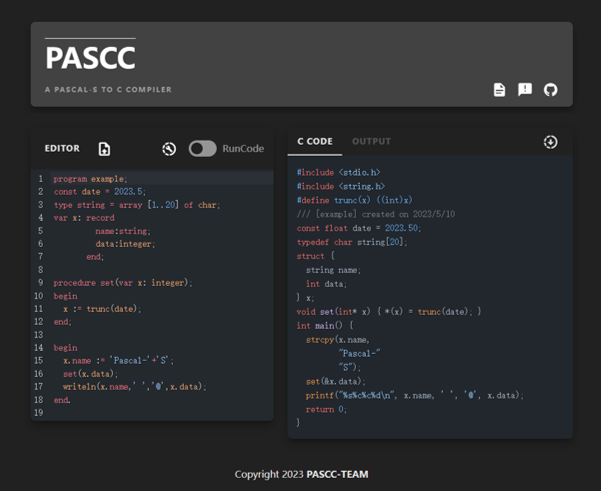

# PASCC
###  A Simple Pascal-S to C Compiler

**课程设计要求及参考文件请查看 `document/reference`**  
**最终汇报文件请查看 `document/report`**

#### Web Server
- 后端仓库地址：[Backend](https://github.com/BUPT-CS-Assignment/PASCC_BACKEND)
- 前端仓库地址：[Frontend](https://github.com/BUPT-CS-Assignment/PASCC_ONLINE)


### Usage
```
/*  test command examples
 *  - arguments list
 *    usage: ${PASCC} [-i] [-o] [-s] [-d] [-t] [-r] 
 *    optional arguments:
 *    tag  name      n-args  note
 *     -h, --help      -     show help message
 *     -i, --input    [?]    input pascal-s file
 *     -o, --output   [?]    output c file
 *     -s, --style    [?]    code style
 *     -d, --debug    [?]    debug mode
 *                           (0: QUIET, 1: ERROR, 2: WARN,
 *                            3: INFO, 4: DEBUG, 5: TRACE)
 *     -t, --test     [?]    test output c file, optional test args
 *     -r, --reserve  [?]    reserve cache files
 *
 *  - set in (out to screen), set code style and reserve cache files
 *      ${PASCC} -i input/input01.txt -s google -r
 *
 *  - set in & out, run c files generated and set running arguments
 *      ${PASCC} -i input/input01.txt -o output/output01.c -t "> test.out"
 *
 */

```


```
/*  测试命令样例
 *  - 参数列表
 *    命令: ${PASCC} [-i] [-o] [-t] [-r]
 *    可选参数:
 *    标记  名字      约束    说明
 *     -h, --help      -     显示帮助信息
 *     -i, --input    [?]    输入Pascal-S源文件目录
 *     -o, --output   [?]    输出C文件目录
 *     -s, --style    [?]    代码风格
 *     -d, --debug    [?]    调试等级
 *                           (0: 静默, 1: 错误, 2: 警告,
 *                            3: 信息, 4: 调试, 5: 堆栈)
 *     -t, --test     [?]    测试输出C程序，包含额外的运行配置（可选）
 *     -r, --reserve  [?]    保留运行时临时文件
 *
 *  - 样例：设置输入文件，设置Google代码风格，保留临时文件
 *      ${PASCC} -i input/input01.txt -s google -r
 *
 *  - 样例：设置输入输出，运行测试，附加运行配置（重定向测试输出到 test.out）
 *      ${PASCC} -i input/input01.txt -o output/output01.c -t "> test.out"
 *
 */
```